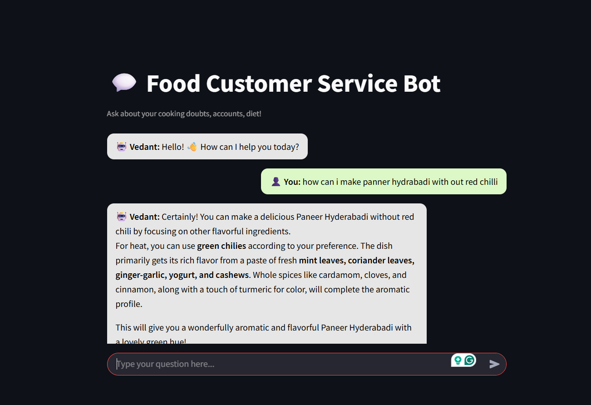
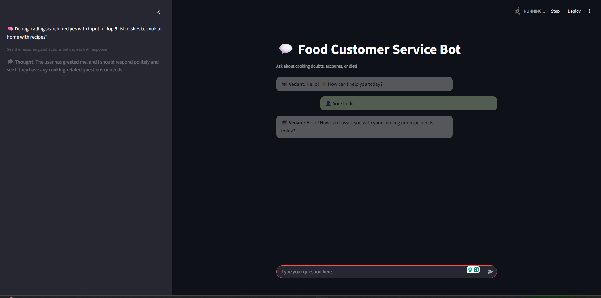
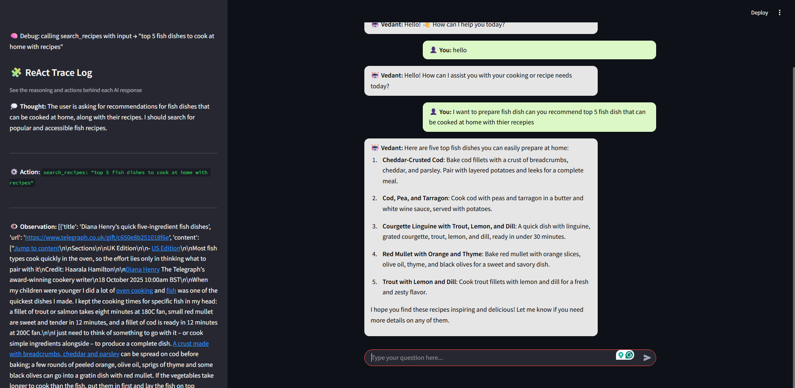
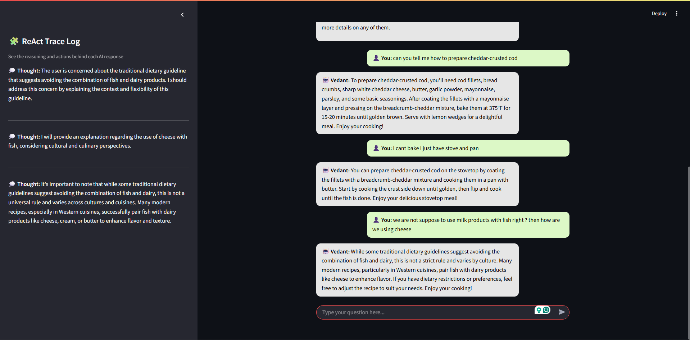
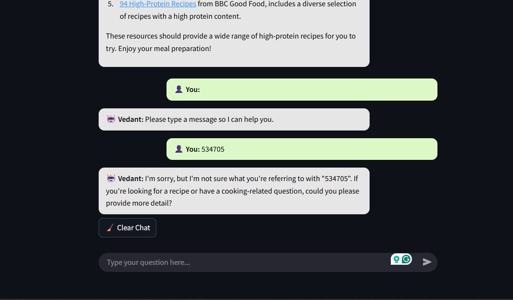

# 🍳 Food Support Chatbot (Gemini + Streamlit)

A friendly AI-powered customer support chatbot designed to help users with **cooking, recipes, ingredients, and account-related questions**.  
Built using **Python**, **Streamlit**, and **Google Gemini 2.5 Flash**, this chatbot provides contextual and memory-based conversations right in your browser.

---

## ✨ Features

| Feature | Description |
|--------|-------------|
| 🤖 Smart Conversations | Remembers previous messages and responds in context |
| 🎨 Clean UI | Chat bubbles for user & bot messages |
| 🔥 Gemini Powered | Uses `gemini-2.5-flash` model for natural responses |
| 🧠 Custom Personality | Behaves as a polite food assistance support agent |
| 🧹 One-Click Clear Chat | Reset conversation anytime |

---

## 🖥️ Demo Screenshot
Chat Response

### Toolcalling for food recepies and restaurants

### Error handling

